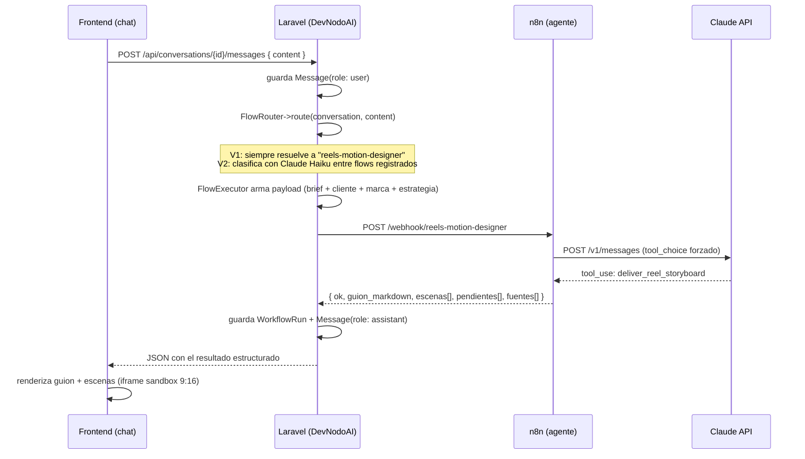

# Arquitectura técnica

## Diagrama de flujo (un mensaje del usuario)



## Capas y responsabilidades

- **Frontend**: UI de chat. No sabe nada de n8n ni de Claude. Solo habla con la API
  JSON de este backend.
- **Laravel (este repo)**: dueño de todo el estado de negocio — usuarios, clientes
  (marcas), conversaciones, mensajes, historial de ejecuciones, y (fase 3) billing.
  Decide **qué** agente ejecutar y **con qué contexto**, no **cómo** el agente genera
  el contenido.
- **n8n**: runtime de agentes sin estado de negocio. Cada workflow es una función
  pura: recibe brief + contexto de marca, llama a Claude con salida estructurada
  forzada (tool use), devuelve el resultado. No conoce usuarios ni planes.
- **Claude (Anthropic API)**: el modelo que efectivamente genera guion/copy/prompts.
  Siempre invocado con `tool_choice` forzado — nunca se parsea Markdown libre.

## Modelo de datos (V1 — Fase 1)

```
User            (ya existe — auth del SaaS)
 └─ Client        (marca/cliente gestionado por el usuario o su equipo)
     ├─ tono, voz
     ├─ visual: paleta[], tipografia, estilo
     ├─ claims_aprobados[]
     └─ estrategia: pilares_contenido[], oferta, etapa_funnel
         └─ Conversation   (hilo de chat, ligado a un Client)
             └─ Message    (role: user | assistant | system)
                 └─ WorkflowRun   (1 por invocación a un agente n8n)
                     ├─ flow_slug
                     ├─ status: pending | running | success | failed
                     ├─ request_payload (json)
                     ├─ response_payload (json)
                     ├─ error (nullable)
                     └─ duration_ms
```

Notas de diseño:

- `Client.tono/visual/claims_aprobados/estrategia` mapean 1:1 al contrato de entrada
  `marca` / `estrategia` que ya espera `reels-motion-designer` (ver
  `n8n-devnodo/docs/01-reels-motion-designer.md`). No hay traducción que inventar:
  el modelo Laravel *es* el payload del webhook.
- `WorkflowRun` guarda el payload completo enviado y recibido. Esto es deliberado:
  cuando se sume el segundo agente y el router real con IA, `WorkflowRun` es la
  fuente de verdad para debuggear por qué el router eligió mal, o por qué Claude no
  devolvió el `tool_use` esperado — sin esto no hay forma de auditar una ejecución
  pasada.
- Un `Message` de rol `assistant` no siempre corresponde a un `WorkflowRun` exitoso:
  si el `FlowRouter` no encuentra un flujo aplicable (fase 2, con varios agentes) o
  si faltan datos críticos de marca, el asistente responde pidiendo esa info sin
  llegar a invocar n8n.

## Contrato de API (Fase 1)

```
POST /api/conversations                     → crea conversación (requiere client_id)
POST /api/conversations/{id}/messages       → envía mensaje del usuario, devuelve
                                               la respuesta del asistente (síncrono)
GET  /api/conversations/{id}                → historial completo (mensajes + runs)
```

Respuesta de `POST /api/conversations/{id}/messages` (caso éxito):

```json
{
  "message": {
    "id": 42,
    "role": "assistant",
    "flow_slug": "reels-motion-designer",
    "content": {
      "guion_markdown": "# Reel — ...",
      "escenas": [{ "numero": 1, "titulo": "Hook", "html": "<!doctype html>..." }],
      "pendientes": [],
      "fuentes": ["marca.tono", "estrategia.oferta"]
    }
  }
}
```

Caso error (n8n no respondió `tool_use`, timeout, etc.):

```json
{
  "message": {
    "id": 43,
    "role": "assistant",
    "flow_slug": "reels-motion-designer",
    "content": null,
    "error": "Claude no devolvió el resultado estructurado esperado."
  }
}
```

Mismo criterio que ya usa n8n: el contrato de error va en el payload, no solo en el
status HTTP, para que el frontend siempre reciba JSON parseable.

## Por qué síncrono en V1 (y cuándo dejar de serlo)

La prueba real contra `reels-motion-designer` respondió en ~20-30s. Un request HTTP
Laravel → n8n con timeout de 90-120s cubre eso sin infraestructura extra (sin colas,
sin callbacks, sin websockets). Es la opción correcta mientras haya **un solo agente
lento pero predecible**.

Se vuelve async (cola + callback) cuando pase cualquiera de estas cosas (Fase 3):

- Un agente nuevo tarda demasiado para un request web (ej. si algún día se agrega
  generación de video real).
- Se quiere permitir que el usuario siga usando la app mientras un flujo corre en
  background.
- Se necesita reintentar automáticamente ejecuciones fallidas sin que el usuario
  tenga que reenviar el mensaje.

El diseño de `WorkflowRun` con estados (`pending/running/success/failed`) ya está
pensado para ese cambio: pasar de síncrono a async es reemplazar *quién* actualiza el
estado (el mismo request vs. un job/callback), no rediseñar el modelo de datos.
